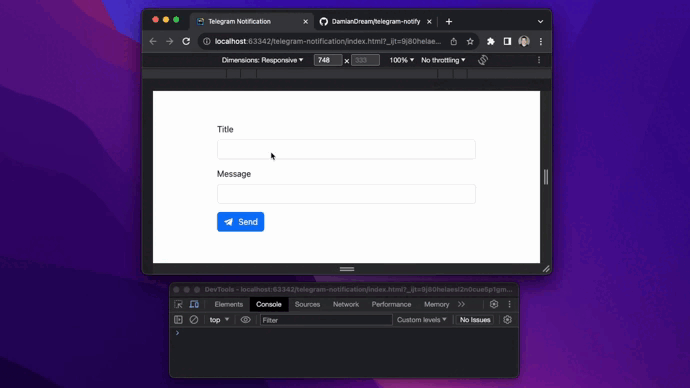

JavaScript Telegram Bot Notification 
====

Simple and robust telegram bot notification, handle customer submit event (or else) and notify web-page owner via telegram notification.
 
Most used: JavaScript and tiny portion of Bootstrap CDN linked Lib 😉